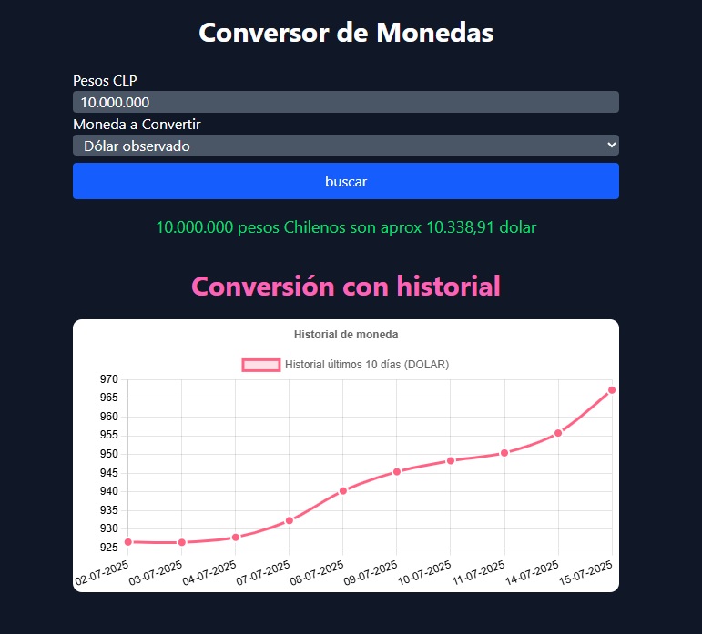

# 💱 Conversor de Monedas

Este proyecto es una aplicación web que permite convertir un monto en **pesos chilenos (CLP)** a una de tres monedas extranjeras (Dólar, Euro o Bitcoin) utilizando datos en tiempo real desde la API pública [mindicador.cl](https://mindicador.cl/). Además, incluye un **gráfico de los últimos 10 días** del valor histórico de la moneda seleccionada.

---

## 🚀 Tecnologías Utilizadas

- ✅ HTML5
- ✅ CSS3
- ✅ Tailwind CSS (CDN)
- ✅ JavaScript
- ✅ Chart.js (para gráficos)
- ✅ API pública [mindicador.cl](https://mindicador.cl)

---

## 📁 Estructura del Proyecto

ConversorMonedas/
├── index.html # Estructura HTML principal
├── assets/
│ ├── css/
│ │ └── style.css # Estilos personalizados
│ ├── img/
│ │ └── pngegg.png # Ícono usado en la pestaña
│ └── js/
│ └── script.js # Lógica del conversor y gráfico
├── README.md # Descripción del proyecto

---

## 🔧 Instalaciones Necesarias

No se requiere instalación de dependencias ni herramientas externas.  
Solo necesitas un navegador moderno (Chrome, Firefox, Edge, etc.)

### ✅ Pasos para usar el proyecto:

1. Clona o descarga este repositorio
2. Abre el archivo `index.html` en tu navegador
3. Ingresa un monto en CLP, selecciona la moneda y haz clic en **Buscar**
4. Verás el resultado convertido y un gráfico con el historial de los últimos 10 días

---

## 💡 Funcionalidades Destacadas

- Conversión en tiempo real desde pesos chilenos a:
  - Dólar (USD)
  - Euro (EUR)
  - Bitcoin (BTC)
- Formato de números con separadores de miles
- Validación para evitar montos superiores a $100.000.000 CLP
- Historial gráfico dinámico de los últimos 10 días
- Interfaz responsiva y moderna usando Tailwind CSS

---

## 👨‍💻 Autor

**Gustavo Cáceres Bozo**  
💼 Desarrollador Web | 📍 Chile  
✉️ gustavocaceresbozo@gmail.com  
📅 Proyecto WEB 
---

## 📸 Captura de Pantalla

